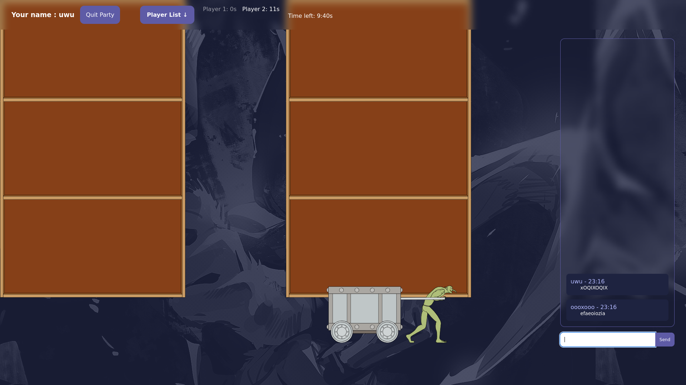
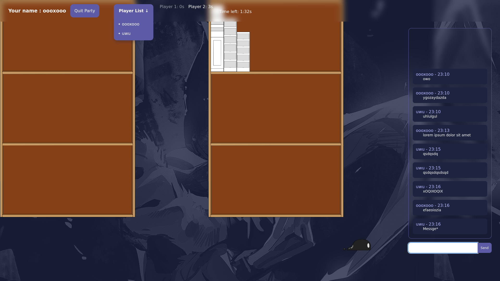

# Projet de
- Léo Milan
- Robin Bacquet

## Fonctions implémentés :
- Connection
- Liste de joueurs
- Chat
- Affichages D3.js des différents éléments graphiques
- timer tour par tour
- Delta Time
- système poussé de comptage de points *(non affiché)*
- Déplacement des élements D3
- Système de suivis de la souris *(non utilisé)*
- Système de bestiaire (création de créatures transportant des livres et possédant des statistiques propres *(partiellement avorté)*)
- Système de vélocitée semi-aléatoire pour les transporteurs de livres
- Système de sélection aléatoire de livres avec random bag

## Capture d'écrans :

## Problèmes rencontrés :
- Corruption de données hardcodées par D3.js
- Node non fonctionnel sous-windows *(tests impossibles sur l'ordinateur personnel d'un des programmeurs)*
- Refus de notre par de recourir à l'IA *(contrairement à nos autres collègues)*
    - de fait manque de temps dû à une surcharge de travail *(large quantité de contrôles continus, projet de programmation S4 comptant pour 5 etcs)*
    - ainsi qu'impossibilité d'exploiter les fonctionnalités de D3.js dû à une documentation trop brumeuse